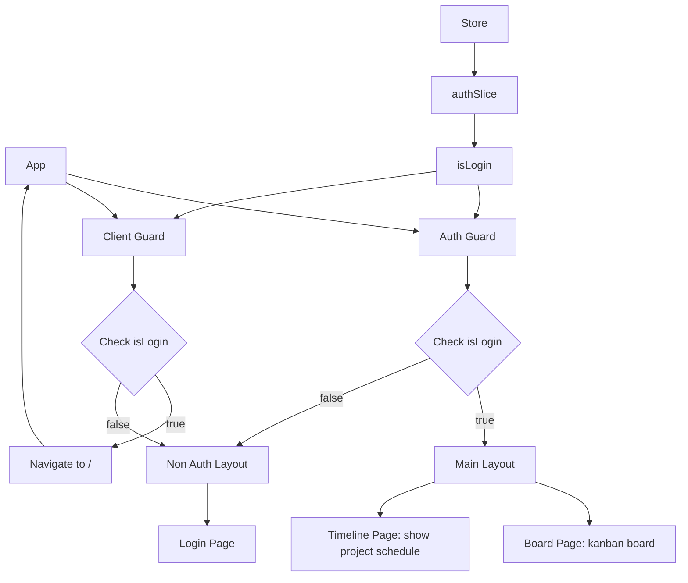
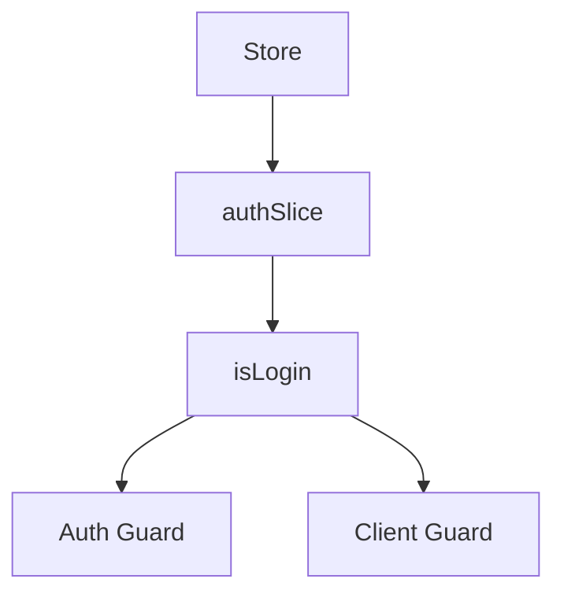

# 20240331: Setup base project

```
├─frontend
| ├──public
| |  ├─assets // public assets
| ├──src
| |  ├─components // reusable components
| |  ├─config // libraries config
| |  ├─hooks // custom hooks
| |  ├─layouts // Layouts to be rendered inside each navigation guard
| |  ├─navigation // Navigation (auth guard, client guard)
| |  ├─pages // Pages to be rendered inside each layout
| |  ├─redux // Redux: store, slices, reducers, thunk
| |  ├─styles // Styles (SCSS)
| |  (... to be updated)
└─backend // to be dev later
```
## Packages
### 1. Redux/ Redux-tooklit/ Redux-persist
#### Init project with **Redux** + **TypeScript** template
> `npx create-react-app . --template redux-typescript`

#### **Redux persist**
> `yarn add redux-persist`
### 2. React-router-dom
> `yarn add react-router-dom`
### 3. Eslint
> `yarn add eslint eslint-plugin-react --dev`
### 4. Prettier
> `yarn add --dev --exact prettier`<br>
> `yarn add eslint-config-prettier --dev`
### 5. TailwindCSS
> `npm install -D tailwindcss`
> `npx tailwindcss init`
### 6. Sass
> `yarn add sass`
### 7. Axios
> `yarn add axios`
### 8. React dnd
> `npm install react-dnd react-dnd-html5-backend`
## Configuration
### 1. Router + redux

### 2. Redux

## <ins>TODO Next day</ins>: Outline project frame (define common components/components)
